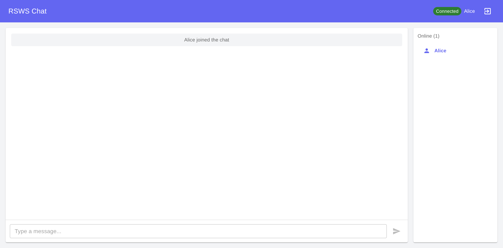

# Multi-User Chat Room Example

A production-ready WebSocket chat room demonstrating the rsws library with a React frontend.



## Features

- Real-time messaging with WebSocket
- User presence tracking (join/leave notifications)
- Message broadcasting to all connected users
- Modern React UI with MUI + Tailwind CSS
- Connection status indicators
- Auto-scroll to new messages
- Responsive design

## Tech Stack

### Backend (Rust)
- `rsws` - WebSocket protocol library
- `tokio` - Async runtime with broadcast channels
- `serde` + `serde_json` - JSON serialization

### Frontend (React)
- React 18 + TypeScript
- Vite - Build tool
- MUI v5 - UI components
- Tailwind CSS v3 - Styling
- `react-use-websocket` - WebSocket integration

## Running the Example

### 1. Start the Backend

```bash
cd examples/chat_room/server
cargo run
```

Server will start on `ws://127.0.0.1:8080`

### 2. Start the Frontend

```bash
cd examples/chat_room/frontend
npm install
npm run dev
```

Frontend will be available at `http://localhost:3000`

### 3. Test the Chat

1. Open `http://localhost:3000` in your browser
2. Enter a username and click "Join Chat"
3. Open another browser tab and join with a different username
4. Send messages - they appear in real-time on both tabs!

## Architecture

### Backend

```
┌─────────────┐
│ TcpListener │ Accepts incoming connections
└──────┬──────┘
       │
       ▼
┌─────────────────┐
│ handle_connection│ Per-connection task
└────────┬────────┘
         │
         ├─► Parse handshake (HTTP → WebSocket)
         ├─► Create Connection
         ├─► Subscribe to broadcast channel
         └─► Message loop (tokio::select!)
                │
                ├─► Client → Server (JOIN, CHAT)
                └─► Broadcast → Client (via channel)
```

### Frontend

```
┌──────────────┐
│   Login      │ Enter username
└──────┬───────┘
       │
       ▼
┌──────────────┐
│  ChatRoom    │ Main chat interface
└──────┬───────┘
       │
       ├─► useChat hook (WebSocket connection)
       ├─► Message list with auto-scroll
       ├─► Input field with send button
       └─► User sidebar (online users)
```

## Message Protocol

### Client → Server

```json
{ "type": "JOIN", "username": "alice" }
{ "type": "CHAT", "content": "Hello world!" }
```

### Server → Client

```json
{ "type": "USER_JOINED", "username": "alice", "users": ["alice", "bob"] }
{ "type": "USER_LEFT", "username": "bob", "users": ["alice"] }
{ "type": "CHAT", "username": "alice", "content": "Hello!", "timestamp": "1738700000" }
{ "type": "ERROR", "message": "Invalid message" }
```

## Key Implementation Details

### Backend
- Uses `tokio::sync::broadcast` for 1-to-N message distribution
- Each connection runs in a separate `tokio::spawn` task
- User state shared via `Arc<RwLock<Vec<String>>>`
- Clean disconnect handling via `tokio::select!`

### Frontend
- `react-use-websocket` with auto-reconnection
- Message deduplication to prevent duplicates on reconnection
- System messages for join/leave events
- Responsive layout with hidden sidebar on mobile

## Building for Production

### Backend

```bash
cd examples/chat_room/server
cargo build --release
```

### Frontend

```bash
cd examples/chat_room/frontend
npm run build
```

The optimized build will be in `frontend/dist/`
